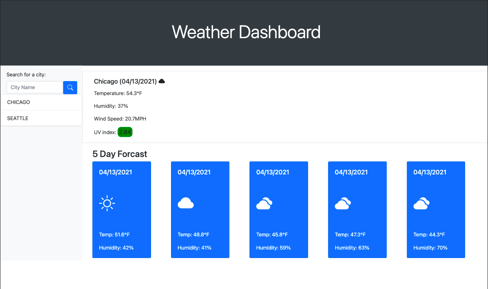

# weatherApp

A weather app with forecasts displayed for the day of and for the 5 day forecast using api calls with fetch. Implementation of JQuery and Bootstrap. Entering a city name will display it's data and then log that entry to the local storage and display in the search history. Depending on the level of the UV Index, the UV Index will be highlighted a specific color. Clicking on a city in the search history and it will display that city's data.

Live link available at https://levickane.github.io/weatherApp/
